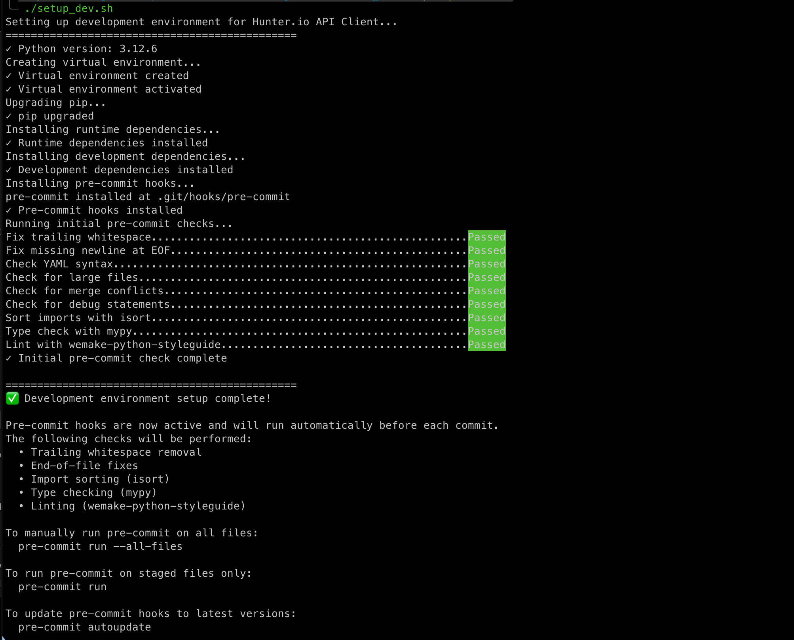

# Hunter.io API Client

A Python client library for the Hunter.io API, built with strict code quality standards. For more details, see the project [task description](_data/TASK.md).

Table of Contents:

* [Features](#features)
* [Installation](#installation)
* [Usage](#usage)
* [Development](#development)
* [CI/CD Pipeline](#cicd-pipeline)

## Features

- Domain Search - Find email addresses from a domain
- Email Finder - Find a specific person's email address
- Email Verifier - Verify if an email address exists
- Full type hints with mypy strict mode
- Strict linting with wemake-python-styleguide

## Installation

```bash
git clone git@github.com:msadig/hunter-client-demo.git
cd hunter-client-demo/

# For setup
./setup_dev.sh
```

Expected output



## Usage

```python
from hunter_wrapper.client import HunterClient

# Initialize client
client = HunterClient(api_key='your_api_key')

# Domain search - Find email addresses from a domain
# Basic usage
result = client.domain_search(domain='instagram.com')

# With optional parameters
result = client.domain_search(
    domain='instagram.com',
    limit=10,                   # Number of emails to return (default: 10, max: 100)
    offset=0,                   # Number of results to skip (for pagination)
    seniority='executive',      # Seniority level: 'junior', 'senior', 'executive'
    department='it',            # Department: 'executive', 'it', 'finance', 'management', etc.
    emails_type='personal'      # Email type: 'personal' or 'generic'
)

# Search by company name instead of domain
result = client.domain_search(company='Instagram')

# Email finder - Find a specific person's email address
# Using first and last name
result = client.email_finder(
    domain='instagram.com',
    first_name='Kevin',
    last_name='Systrom'
)

# Using full name
result = client.email_finder(
    domain='instagram.com',
    full_name='Kevin Systrom'
)

# Using company name instead of domain
result = client.email_finder(
    company='Instagram',
    first_name='Kevin',
    last_name='Systrom'
)

# Email verifier - Verify if an email address exists
result = client.email_verifier('kevin@instagram.com')

# Raw responses - Get the full requests.Response object
raw_response = client.domain_search(domain='instagram.com', raw=True)
raw_response = client.email_finder(domain='instagram.com', first_name='Kevin', last_name='Systrom', raw=True)
raw_response = client.email_verifier('kevin@instagram.com', raw=True)
```

## Development

```bash
# Run tests
pytest tests/

# Code quality
mypy hunter_wrapper/
flake8 hunter_wrapper/
isort hunter_wrapper/
```

## CI/CD Pipeline

Automated workflows ensure code quality and reliability on every push and pull request to the main branch.

### What We Protect Against

**Integration Tests**: Prevents broken functionality from reaching production by testing all API methods with real Hunter.io endpoints and generating coverage reports.

**Quality Checks**: Enforces strict code standards to prevent:
- Security vulnerabilities and code smells
- Type errors and inconsistent formatting
- Poor documentation and maintainability issues
- Import/dependency problems

All checks must pass before code can be merged, ensuring consistent quality across the codebase.

---

### Disclaimer:

Author: Sadig Muradov

The application was tested on macOS with Python 3.11+.
